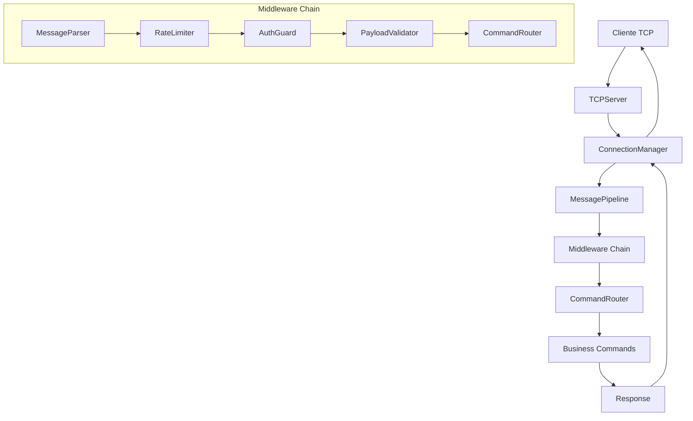
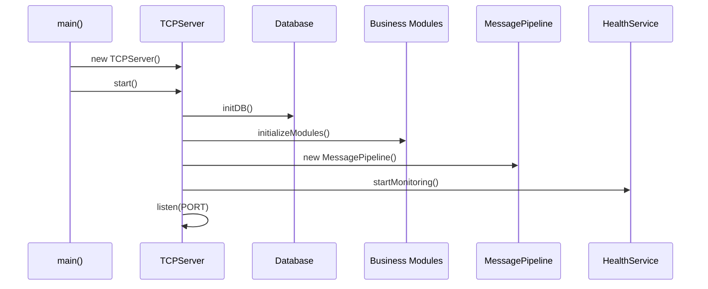
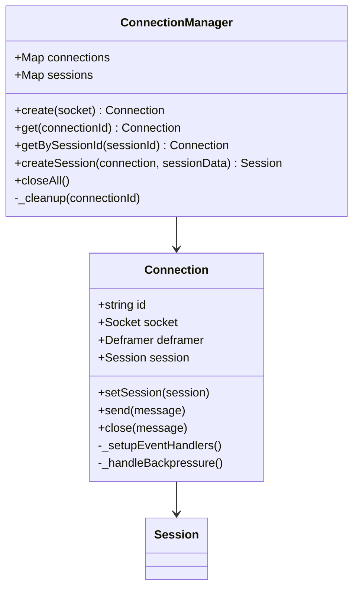
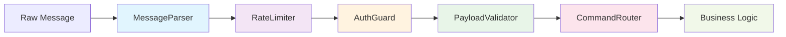
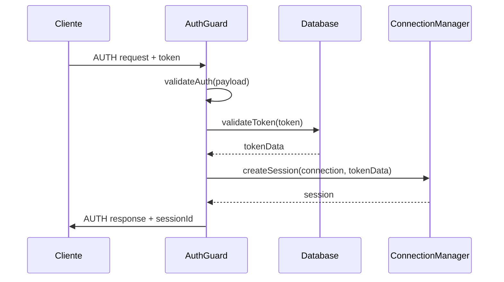
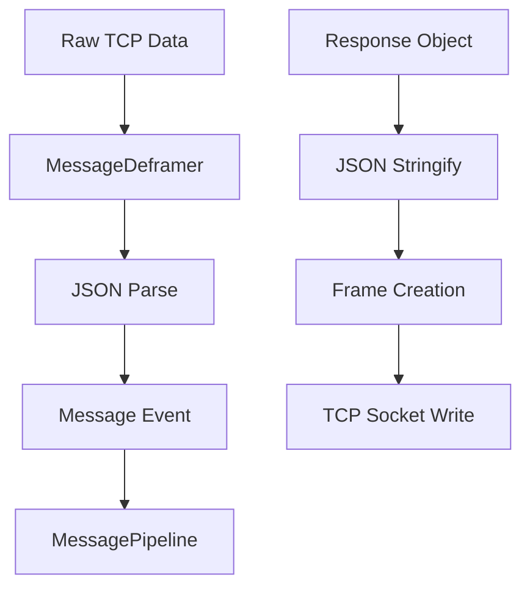
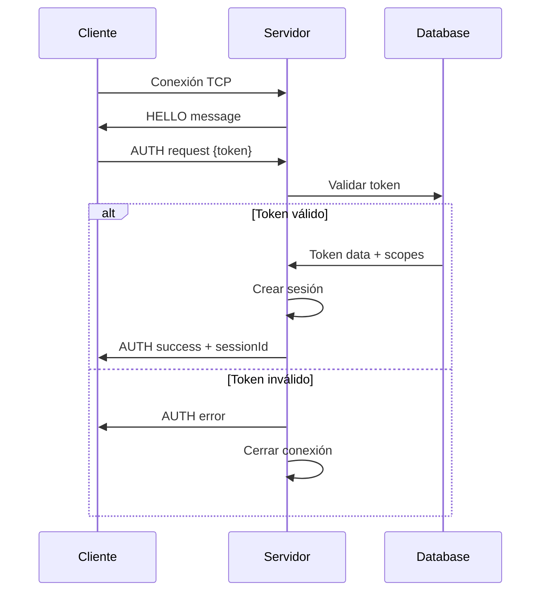

# 📡 Documentación del Servidor TCP

## 🏗️ Arquitectura General

El servidor TCP está diseñado con una arquitectura modular y escalable que sigue principios de separación de responsabilidades y el patrón Chain of Responsibility para el procesamiento de mensajes.

### 🔄 Flujo de Procesamiento Principal



## 🧱 Componentes Principales

### 1. 🚀 TCPServer (Core Entry Point)

**Ubicación:** `src/server/core/server.js`

**Responsabilidades:**
- Inicialización del servidor TCP
- Gestión del ciclo de vida del servidor
- Configuración de dependencias
- Graceful shutdown

#### Proceso de Inicialización



#### Características Técnicas

- **Puerto:** Configurable via `CONFIG.PORT`
- **Graceful Shutdown:** Maneja señales SIGINT y SIGTERM
- **Error Handling:** Logging centralizado de errores
- **TCP Optimizations:** 
  - `setNoDelay(true)` - Desactiva algoritmo de Nagle
  - `setKeepAlive(true)` - Mantiene conexiones vivas

### 2. 🔗 ConnectionManager

**Ubicación:** `src/server/core/connection-manager.js`

**Responsabilidades:**
- Gestión del ciclo de vida de conexiones TCP
- Creación y destrucción de conexiones
- Manejo de sesiones de usuario
- Configuración del pipeline de transporte
- Cleanup automático de recursos

#### Estructura de Conexión



#### Características Técnicas

- **ID Generation:** Usa `crypto.randomBytes(8)` para IDs únicos
- **Transport Pipeline:** Configuración automática de framing/deframing
- **Backpressure Handling:** Pausa/resume de streams según presión de escritura
- **Session Management:** Asociación automática conexión-sesión
- **Resource Cleanup:** Limpieza automática en desconexión

### 3. 🔄 MessagePipeline

**Ubicación:** `src/server/core/message-pipeline.js`

**Responsabilidades:**
- Implementación del patrón Chain of Responsibility
- Orquestación de middlewares
- Gestión de contexto de procesamiento
- Manejo centralizado de errores

#### Cadena de Middlewares



#### Contexto de Procesamiento

Cada middleware recibe un contexto que contiene:

```javascript
{
  connection: Connection,    // Conexión TCP activa
  message: Object,          // Mensaje parseado
  session: Session,         // Sesión del usuario (si autenticado)
  db: Database,            // Instancia de base de datos
  reply: Function,         // Helper para enviar respuesta
  close: Function          // Helper para cerrar conexión
}
```

### 4. 🛡️ Sistema de Middlewares

#### 4.1 MessageParser

**Responsabilidades:**
- Validación del envelope del mensaje
- Verificación de versión del protocolo
- Validación de tipos de mensaje

#### 4.2 RateLimiter

**Responsabilidades:**
- Control de velocidad de requests
- Prevención de ataques de spam
- Configuración por conexión

#### 4.3 AuthGuard

**Responsabilidades:**
- Procesamiento de autenticación
- Validación de tokens
- Gestión de sesiones
- Control de acceso por endpoint



#### 4.4 PayloadValidator

**Responsabilidades:**
- Validación de schemas de payload
- Sanitización de datos de entrada
- Generación de errores descriptivos

#### 4.5 CommandRouter

**Responsabilidades:**
- Resolución de comandos por acción
- Validación de scopes/permisos
- Ejecución de business logic
- Manejo de respuestas

### 5. 📊 HealthService

**Ubicación:** `src/server/core/health-service.js`

**Responsabilidades:**
- Monitoreo de conexiones activas
- Logging de eventos de conexión
- Métricas de rendimiento
- Detección de problemas

### 6. 🗄️ Sistema de Comandos

**Ubicación:** `src/server/business/commands/`

#### Estructura de Comando

```javascript
export default {
  scope: "REQUIRED_SCOPE",     // Scope necesario para ejecutar
  closeAfter: false,           // Si cerrar conexión después
  handler: async (context) => {
    // Lógica del comando
    return responseData;
  }
}
```

#### Comandos Disponibles

1. **GET_OS_INFO**
   - **Scope:** `GET_OS_INFO`
   - **Función:** Obtener información del sistema operativo
   - **Response:** Datos de OS, uptime, samples de rendimiento

2. **QUIT**
   - **Scope:** Ninguno requerido
   - **Función:** Cerrar conexión gracefully
   - **Response:** Confirmación de cierre

## 🔧 Sistema de Transporte

### Frame Protocol

El servidor utiliza un protocolo de framing personalizado:

```
[4 bytes length][JSON payload]
```

#### Características del Transporte

- **Max Frame Size:** 256KB (262,144 bytes)
- **Encoding:** UTF-8 JSON
- **Backpressure:** Manejo automático
- **Error Recovery:** Detección de frames corruptos



## 🔐 Sistema de Autenticación y Autorización

### Flujo de Autenticación



### Sistema de Scopes

Los scopes controlan qué comandos puede ejecutar un usuario:

- `AUTH`: Siempre permitido (requerido para autenticación)
- `GET_OS_INFO`: Acceso a información del sistema
- `ADMIN`: Acceso administrativo completo

## 📈 Configuración y Límites

### Configuración Principal (`config.js`)

```javascript
{
  PORT: 3000,                    // Puerto del servidor
  MAX_FRAME: 262144,             // 256KB max frame
  HEARTBEAT_MS: 30000,           // 30s heartbeat
  MAX_IN_FLIGHT: 8,              // Requests concurrentes
  SESSION_TIMEOUT: 1800000       // 30min timeout
}
```

### Rate Limiting

- **Límite por conexión:** Configurable
- **Ventana de tiempo:** Sliding window
- **Respuesta:** Error `RATE_LIMITED`

## 🚨 Manejo de Errores

### Tipos de Error

1. **Transport Errors:** Problemas de red/protocolo
2. **Authentication Errors:** Fallos de autenticación
3. **Validation Errors:** Datos malformados
4. **Business Logic Errors:** Errores de aplicación
5. **System Errors:** Errores internos del servidor

### Error Handler

Centraliza el manejo de errores y:
- Convierte excepciones a mensajes de error estándar
- Registra errores en logs
- Decide si cerrar la conexión
- Evita leaking de información sensible

## 🔍 Logging y Monitoreo

### Sistema de Logging

- **Biblioteca:** Winston (logger personalizado)
- **Niveles:** ERROR, WARN, INFO, DEBUG
- **Formato:** JSON estructurado
- **Contexto:** Request ID, conexión, sesión

### Métricas Monitoreadas

- Conexiones activas
- Requests por segundo
- Tiempo de respuesta promedio
- Errores por tipo
- Memoria y CPU usage

## 🛠️ Desarrollo y Extensibilidad

### Agregar Nuevo Comando

1. Crear directorio en `src/server/business/commands/`
2. Implementar `command.js` con handler
3. Definir schema en `schema.js`
4. Exportar en `index.js`
5. El sistema auto-descubre el comando

### Agregar Middleware

1. Implementar clase con método `process(context)`
2. Agregar a la cadena en `MessagePipeline`
3. Configurar dependencias si es necesario

### Testing

- Unit tests para cada componente
- Integration tests para flujos completos
- Load testing para rendimiento
- Security testing para vulnerabilidades

---

## 📋 Resumen de Flujo Completo

1. **Cliente se conecta** → TCPServer acepta conexión
2. **ConnectionManager** crea Connection y envía HELLO
3. **Cliente envía AUTH** → Pipeline procesa autenticación
4. **AuthGuard** valida token y crea sesión
5. **Cliente envía comandos** → Pipeline valida y enruta
6. **CommandRouter** ejecuta business logic
7. **Respuesta** se envía de vuelta al cliente
8. **Cliente cierra** → Cleanup automático de recursos

Esta arquitectura garantiza escalabilidad, mantenibilidad y seguridad en el procesamiento de mensajes TCP.
