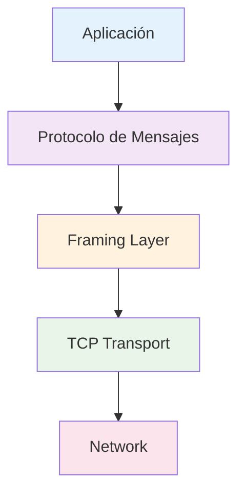
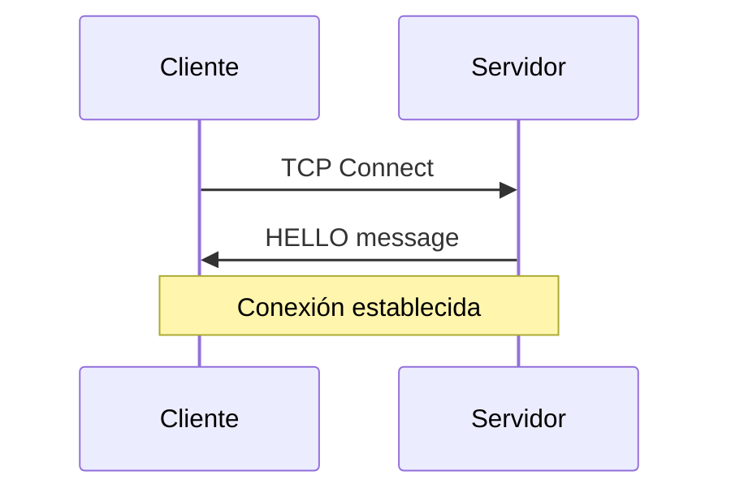
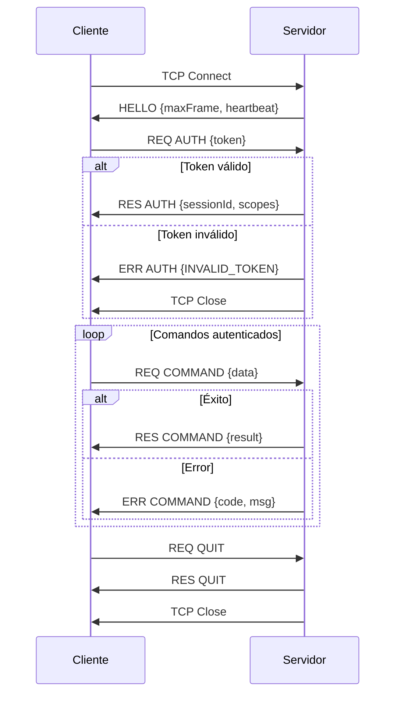
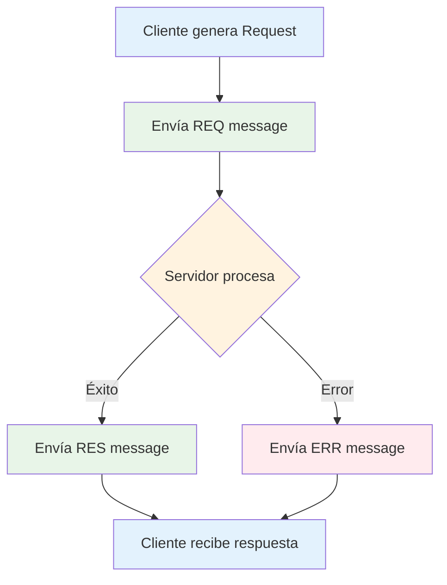
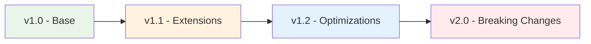

# 📡 Documentación del Protocolo de Comunicación

## 🎯 Descripción General

Este protocolo define la comunicación entre cliente y servidor sobre TCP. Es un protocolo binario con framing personalizado que transporta mensajes JSON estructurados.

## 🏗️ Arquitectura del Protocolo

### Capas del Protocolo



### Stack de Protocolos

1. **TCP Layer:** Transporte confiable
2. **Framing Layer:** Delimitación de mensajes
3. **JSON Layer:** Serialización de datos
4. **Message Layer:** Estructura de mensajes
5. **Application Layer:** Lógica de negocio

## 🔧 Framing Protocol

### Estructura del Frame

```
┌─────────────┬──────────────────────┐
│   4 bytes   │     N bytes          │
│   Length    │   JSON Payload       │
│  (Big End.) │                      │
└─────────────┴──────────────────────┘
```

#### Características del Frame

- **Length Field:** 4 bytes en Big Endian
- **Max Frame Size:** 262,144 bytes (256KB)
- **Encoding:** UTF-8 para el payload JSON
- **Byte Order:** Network byte order (Big Endian)

#### Ejemplo de Frame

```
Length: 0x0000002A (42 bytes)
Payload: {"v":1,"t":"req","id":"abc123","act":"PING"}
```

```
Hex: 0000002A 7B2276223A312C2274223A22726571222C226964223A22616263313233222C22616374223A2250494E47227D
```

## 📨 Estructura de Mensajes

### Envelope Básico

Todos los mensajes comparten un envelope común:

```javascript
{
  "v": 1,           // Versión del protocolo
  "t": "tipo",      // Tipo de mensaje
  "id": "msg_id"    // ID único del mensaje (para req/res)
}
```

### Tipos de Mensaje

#### 1. 🔄 HELLO - Saludo Inicial

**Propósito:** Iniciación de la conexión y negociación de parámetros

```javascript
{
  "v": 1,
  "t": "hello",
  "data": {
    "maxFrame": 262144,     // Tamaño máximo de frame soportado
    "heartbeat": 30000      // Intervalo de heartbeat en ms
  }
}
```

**Flujo:**


#### 2. 📤 REQ - Request

**Propósito:** Solicitud de acción del cliente al servidor

```javascript
{
  "v": 1,
  "t": "req",
  "id": "request_id",      // ID único para correlación
  "act": "ACTION_NAME",    // Acción solicitada
  "data": {                // Payload opcional
    // ... datos específicos de la acción
  }
}
```

#### 3. 📥 RES - Response

**Propósito:** Respuesta exitosa del servidor

```javascript
{
  "v": 1,
  "t": "res",
  "id": "request_id",      // Mismo ID del request
  "act": "ACTION_NAME",    // Acción que se está respondiendo
  "data": {                // Datos de respuesta
    // ... resultado de la acción
  }
}
```

#### 4. ❌ ERR - Error

**Propósito:** Respuesta de error del servidor

```javascript
{
  "v": 1,
  "t": "err",
  "id": "request_id",      // Mismo ID del request (si aplica)
  "act": "ACTION_NAME",    // Acción que falló
  "code": "ERROR_CODE",    // Código de error estándar
  "msg": "Error message",  // Mensaje descriptivo
  "details": {             // Detalles adicionales (opcional)
    // ... información extra del error
  }
}
```

## 🎬 Flujos de Comunicación

### Flujo de Conexión Completo



### Flujo de Request/Response



## 🔐 Autenticación y Sesiones

### Proceso de Autenticación

#### 1. Request de Autenticación

```javascript
{
  "v": 1,
  "t": "req",
  "id": "auth_001",
  "act": "AUTH",
  "data": {
    "token": "jwt_token_here"
  }
}
```

#### 2. Respuesta Exitosa

```javascript
{
  "v": 1,
  "t": "res", 
  "id": "auth_001",
  "act": "AUTH",
  "data": {
    "sessionId": "sess_abc123",
    "scopes": ["GET_OS_INFO", "PING"]
  }
}
```

#### 3. Respuesta de Error

```javascript
{
  "v": 1,
  "t": "err",
  "id": "auth_001", 
  "act": "AUTH",
  "code": "INVALID_TOKEN",
  "msg": "Invalid, expired, or revoked token"
}
```

### Gestión de Sesiones

- **Session ID:** Generado por el servidor tras autenticación exitosa
- **Duración:** 30 minutos de inactividad
- **Scopes:** Lista de permisos asignados al token
- **Persistencia:** Solo en memoria del servidor

## 🎯 Acciones Disponibles

### Core Actions (Siempre disponibles)

#### 1. AUTH - Autenticación

**Scope requerido:** Ninguno (pre-autenticación)

**Request:**
```javascript
{
  "v": 1,
  "t": "req",
  "id": "msg_001",
  "act": "AUTH",
  "data": {
    "token": "eyJhbGciOiJIUzI1NiIsInR5cCI6IkpXVCJ9..."
  }
}
```

**Response exitosa:**
```javascript
{
  "v": 1,
  "t": "res",
  "id": "msg_001",
  "act": "AUTH", 
  "data": {
    "sessionId": "sess_abc123",
    "scopes": ["GET_OS_INFO", "PING", "QUIT"]
  }
}
```

#### 2. PING - Heartbeat

**Scope requerido:** Cualquier sesión autenticada

**Request:**
```javascript
{
  "v": 1,
  "t": "req", 
  "id": "msg_002",
  "act": "PING"
}
```

**Response:**
```javascript
{
  "v": 1,
  "t": "res",
  "id": "msg_002",
  "act": "PING",
  "data": {
    "timestamp": 1693574400000
  }
}
```

#### 3. QUIT - Cierre de Conexión

**Scope requerido:** Cualquier sesión autenticada

**Request:**
```javascript
{
  "v": 1,
  "t": "req",
  "id": "msg_003", 
  "act": "QUIT"
}
```

**Response:**
```javascript
{
  "v": 1,
  "t": "res",
  "id": "msg_003",
  "act": "QUIT",
  "data": {
    "message": "Goodbye"
  }
}
```

### Business Actions

#### 1. GET_OS_INFO - Información del Sistema

**Scope requerido:** `GET_OS_INFO`

**Request:**
```javascript
{
  "v": 1,
  "t": "req",
  "id": "msg_004",
  "act": "GET_OS_INFO",
  "data": {
    "seconds": 60    // Opcional: ventana de tiempo
  }
}
```

**Response:**
```javascript
{
  "v": 1, 
  "t": "res",
  "id": "msg_004",
  "act": "GET_OS_INFO",
  "data": {
    "uptimeSeconds": 60,
    "os": "linux",
    "samples": [
      {
        "cpu": 0.12,
        "mem": 2048,
        "time": 1693574400000
      }
    ]
  }
}
```

## ❌ Códigos de Error

### Categorías de Error

#### 1. 🔍 Errores de Request
- `BAD_REQUEST`: Formato de mensaje inválido
- `UNKNOWN_ACTION`: Acción no reconocida
- `PAYLOAD_TOO_LARGE`: Payload excede límites

#### 2. 🔐 Errores de Autenticación
- `AUTH_REQUIRED`: Se requiere autenticación
- `UNAUTHORIZED`: Token faltante o inválido
- `INVALID_TOKEN`: Token malformado o expirado
- `TOKEN_EXPIRED`: Token válido pero expirado

#### 3. 🚫 Errores de Autorización
- `FORBIDDEN`: Permisos insuficientes

#### 4. 🚦 Errores de Control
- `RATE_LIMITED`: Demasiadas requests

#### 5. 🔧 Errores del Sistema
- `INTERNAL_ERROR`: Error interno del servidor
- `CONNECTION`: Problemas de conexión

### Estructura de Error Detallada

```javascript
{
  "v": 1,
  "t": "err",
  "id": "msg_005", 
  "act": "GET_OS_INFO",
  "code": "FORBIDDEN",
  "msg": "Required scope: GET_OS_INFO",
  "details": {
    "requiredScope": "GET_OS_INFO",
    "userScopes": ["PING", "QUIT"],
    "suggestion": "Contact admin for scope assignment"
  }
}
```

## 📏 Límites y Restricciones

### Límites del Protocolo

```javascript
{
  MAX_FRAME: 262144,        // 256KB por mensaje
  HEARTBEAT_MS: 30000,      // 30 segundos entre heartbeats  
  MAX_IN_FLIGHT: 8,         // Requests concurrentes por conexión
  SESSION_TIMEOUT: 1800000, // 30 minutos de inactividad
  MIN_CLIENT_VERSION: 1,    // Versión mínima de cliente
  MIN_SERVER_VERSION: 1     // Versión mínima de servidor
}
```

### Rate Limiting

- **Por conexión:** Configurable por middleware
- **Ventana:** Sliding window algorithm
- **Respuesta:** Error `RATE_LIMITED` con retry info

## 🔄 Versionado y Compatibilidad

### Versionado Semántico

- **Versión actual:** 1
- **Compatibilidad:** Hacia atrás con misma versión mayor
- **Negociación:** En mensaje HELLO

### Evolución del Protocolo



### Compatibilidad de Versiones

```javascript
// En mensaje HELLO
{
  "v": 1,
  "t": "hello", 
  "data": {
    "protocolVersion": 1,
    "minSupportedVersion": 1,
    "maxSupportedVersion": 1,
    "extensions": ["heartbeat", "compression"]
  }
}
```

## 🛡️ Seguridad del Protocolo

### Medidas de Seguridad Implementadas

#### 1. 🔒 Autenticación Obligatoria
- Todo comando requiere autenticación previa
- Tokens JWT con expiración
- Validación en cada request

#### 2. 🎫 Control de Acceso por Scopes
- Granularidad fino de permisos
- Validación por comando
- Denial por defecto

#### 3. 🚦 Rate Limiting
- Prevención de ataques de spam
- Límites por conexión
- Backoff exponencial

#### 4. 📏 Validación Estricta
- Validación de envelope
- Schemas de payload
- Sanitización de entrada

#### 5. 🔍 Logging y Auditoría
- Log de todas las acciones
- Trazabilidad de requests
- Detección de anomalías

### Mejores Prácticas de Seguridad

1. **Usar HTTPS/TLS en producción**
2. **Validar todos los inputs**
3. **Implementar timeouts apropiados**
4. **Monitorear conexiones anómalas**
5. **Rotar tokens periódicamente**

## 🧪 Testing del Protocolo

### Casos de Prueba

#### 1. 🔄 Conectividad Básica
```javascript
// Test: Conexión y HELLO
connect() → expect(HELLO)
```

#### 2. 🔐 Autenticación
```javascript
// Test: Auth exitosa
send(AUTH, {token: valid}) → expect(RES, {sessionId})

// Test: Auth fallida  
send(AUTH, {token: invalid}) → expect(ERR, {INVALID_TOKEN})
```

#### 3. 📨 Request/Response
```javascript
// Test: Comando exitoso
authenticate() → send(PING) → expect(RES, {timestamp})

// Test: Comando sin permisos
authenticate(limitedToken) → send(GET_OS_INFO) → expect(ERR, {FORBIDDEN})
```

#### 4. ❌ Manejo de Errores
```javascript
// Test: Payload inválido
send(REQ, {malformed}) → expect(ERR, {BAD_REQUEST})

// Test: Acción desconocida
send(REQ, {act: "UNKNOWN"}) → expect(ERR, {UNKNOWN_ACTION})
```

### Herramientas de Testing

1. **Unit Tests:** Validación de parsers/builders
2. **Integration Tests:** Flujos completos
3. **Load Tests:** Rendimiento bajo carga
4. **Security Tests:** Penetration testing

## 📊 Ejemplos de Implementación

### Cliente Simple en Node.js

```javascript
import net from 'net';
import { MessageDeframer, sendMessage } from './transport.js';

class SimpleClient {
  constructor() {
    this.socket = null;
    this.sessionId = null;
  }
  
  async connect(host, port) {
    this.socket = net.connect(port, host);
    
    // Setup deframing
    const deframer = new MessageDeframer();
    this.socket.pipe(deframer);
    
    deframer.on('data', (buffer) => {
      const message = JSON.parse(buffer.toString());
      this.handleMessage(message);
    });
    
    // Wait for HELLO
    await this.waitForHello();
  }
  
  async authenticate(token) {
    const response = await this.sendRequest('AUTH', { token });
    this.sessionId = response.data.sessionId;
    return response;
  }
  
  async ping() {
    return await this.sendRequest('PING');
  }
  
  async sendRequest(action, data = null) {
    const id = Math.random().toString(36);
    const message = {
      v: 1,
      t: 'req',
      id,
      act: action,
      data
    };
    
    sendMessage(this.socket, message);
    return await this.waitForResponse(id);
  }
}
```

### Ejemplo de Sesión Completa

```javascript
const client = new SimpleClient();

// 1. Conectar
await client.connect('localhost', 3000);
// ← HELLO recibido

// 2. Autenticar  
await client.authenticate('your_jwt_token');
// ← RES AUTH {sessionId, scopes}

// 3. Enviar comandos
const pingResult = await client.ping();
// ← RES PING {timestamp}

const osInfo = await client.sendRequest('GET_OS_INFO', {seconds: 60});
// ← RES GET_OS_INFO {uptimeSeconds, os, samples}

// 4. Cerrar
await client.sendRequest('QUIT');
// ← RES QUIT {message}
// ← Conexión cerrada
```

## 📈 Métricas y Monitoreo

### Métricas del Protocolo

- **Mensajes por segundo:** Rate de procesamiento
- **Latencia promedio:** Tiempo request→response  
- **Error rate:** Porcentaje de errores por tipo
- **Conexiones activas:** Usuarios concurrentes
- **Throughput:** Bytes transferidos

### Monitoreo de Salud

```javascript
// Healthcheck endpoint
{
  "status": "healthy",
  "metrics": {
    "activeConnections": 42,
    "messagesPerSecond": 150,
    "averageLatency": "12ms",
    "errorRate": "0.1%"
  },
  "protocol": {
    "version": 1,
    "uptime": "2h 15m",
    "totalMessages": 324000
  }
}
```

---

## 📋 Resumen del Protocolo

### Características Principales

- ✅ **Binario con framing** para delimitación clara
- ✅ **JSON payload** para flexibilidad  
- ✅ **Request/Response** con correlación por ID
- ✅ **Autenticación obligatoria** con JWT tokens
- ✅ **Control de acceso** granular por scopes
- ✅ **Rate limiting** para protección
- ✅ **Manejo robusto de errores** con códigos estándar
- ✅ **Versionado** para evolución controlada

### Beneficios del Diseño

1. **Simplicidad:** Fácil de implementar y debuggear
2. **Extensibilidad:** Nuevas acciones sin breaking changes
3. **Seguridad:** Múltiples capas de protección
4. **Performance:** Framing eficiente y parseo rápido
5. **Observabilidad:** Logging y métricas integradas

Este protocolo proporciona una base sólida para comunicación cliente-servidor escalable y segura.
